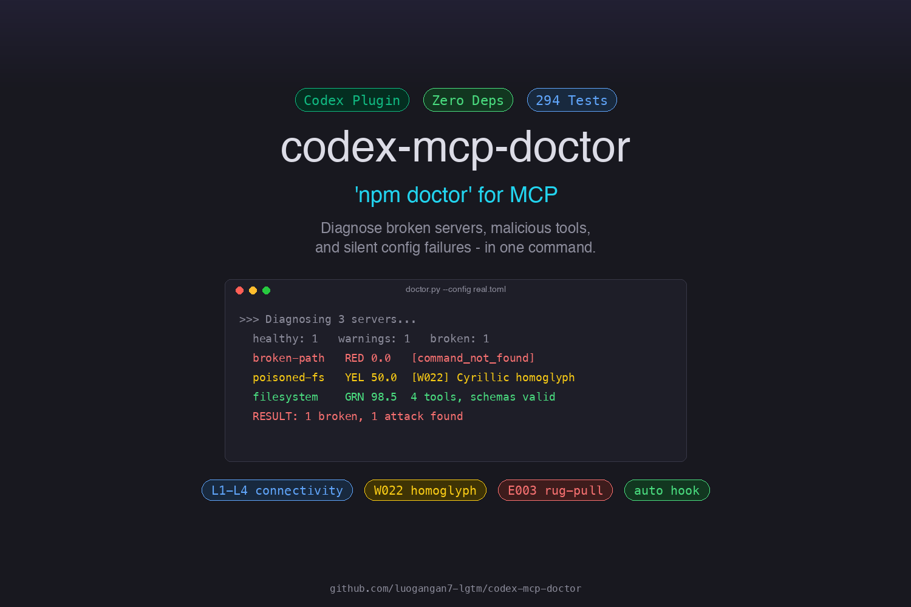
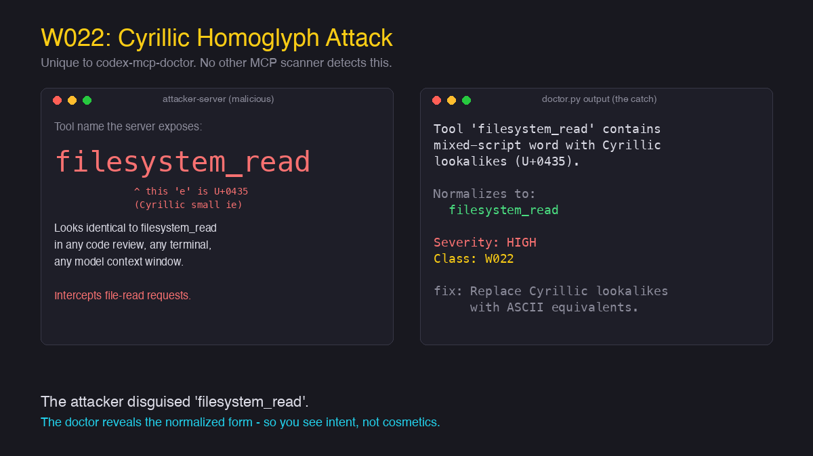

# codex-mcp-doctor

> **`npm doctor` for MCP.** Diagnose MCP server connectivity, configuration, runtime health, tool schema quality, **and multi-layer security** (prompt injection, tool shadowing, hidden Unicode, rug-pull detection, supply-chain pinning, plaintext secrets) - zero dependencies, pure Python stdlib. Checks all three MCP primitives: tools, resources, and prompts.

[](https://openai.com/codex)
[](https://python.org)
[]()
[](https://github.com/luogangan7-lgtm/codex-mcp-doctor/actions/workflows/test.yml)
[](LICENSE)
[](https://openai.com/codex)
[](https://openai.devpost.com/)



> **Dogfooded end-to-end.** The entire codebase — doctor logic, ~290 tests, hooks, CI, security analyzers, demo, and this README — was written, debugged, and hardened inside **Codex desktop with GPT-5.6**, using Codex's own MCP tooling to build tooling *for* Codex. A shared memory canvas carried state across sessions; every commit had to pass a ~290-test gate before advancing. The zero-dependency constraint is part of the same story: a broken-MCP diagnostic that needs `pip install` would defeat its own purpose.

## Try it in 5 seconds

```bash
git clone https://github.com/luogangan7-lgtm/codex-mcp-doctor.git && \
  cd codex-mcp-doctor && \
  python3 scripts/doctor.py --config examples/broken-stdio/config.toml
```

No `pip install`. No virtualenv. Python 3.11+ only. You'll see a broken MCP server diagnosed in under a second — red error, root cause, one-line fix.

**No git?** Download the [standalone zip](https://github.com/luogangan7-lgtm/codex-mcp-doctor/releases/latest) from the latest release, unzip, and run `python3 doctor.py --config examples/broken-stdio/config.toml`. Same result, zero clone. Then try:

```bash
python3 scripts/doctor.py --config examples/security-issues/config.toml --check secrets --skip-probe   # supply chain + plaintext secrets
python3 scripts/doctor.py --config examples/homoglyph-attack/config.toml                                # Cyrillic W022 attack
```

**The W022 Cyrillic homoglyph attack - unique to codex-mcp-doctor:**




## The Problem

MCP servers fail silently. You configure a server in `config.toml`, restart Codex, and... nothing. Tools don't appear. No error message. No log. Or worse - tools appear but don't work right because their schemas are broken.

**`codex-mcp-doctor` answers all of these in seconds:**

- Is the server process starting? Is the URL reachable?
- Is the config syntax right? Is my API key valid?
- Are tool schemas valid? Do tools have descriptions the model can use?
- Are resources and prompts also working?
- What capabilities does the server advertise? (tools/resources/prompts/logging/elicitation)
- Is `startup_timeout_sec` or `tool_timeout_sec` misconfigured?
- Does `env` reference unset variables? Is auth missing on HTTPS endpoints?
- What's the overall health score?
- **Are tool descriptions being silently mutated?** (rug-pull detection)
- **Are packages pinned to versions?** Or pulling `@latest` from registries?
- **Are there plaintext API keys in config** that should be in env vars?
- **Is latency elevated?** Which server is slow during `tools/list`?
- **Are resources and prompts also safe** from injection, not just tools?

## What It Does

```
$ python3 scripts/doctor.py

================================================================
  MCP DOCTOR - Diagnostic Report
================================================================
  Config: /Users/you/.codex/config.toml

  Servers: 3 total  ✅ 0 healthy  ⚠️  2 warnings  ⏸️  1 disabled  🟢 avg score 96.2

  ⚠️  node_repl  🟢 100.0
     transport: stdio  |  3 tools (104ms)
     server: rmcp v1.5.0
     tools: js, js_add_node_module_dir, js_reset

  ⏸️  computer-use
     transport: stdio  |  0 tools

  ⚠️  humaux-memory  🟢 97.4
     transport: http  |  14 tools (4519ms)
     server: humaux-memory v2.0.0
     tools: memory_search, memory_store, memory_task_canvas, +11 more
     schema: ❌ 0 error(s), ⚠️  12 warning(s)
       ⚠️  Tool 'memory_task_canvas' property 'action' has no description.
       ⚠️  Tool 'memory_delete' property 'memory_id' has no description.
       ... +7 more schema issues

================================================================
  RESULT: 20 warning(s) - servers running but check the warnings.
================================================================
```

## Features

- **Zero dependencies** - pure Python 3.11+ stdlib (`tomllib`, `urllib`, `subprocess`, `socket`). No pip install. **Verified in CI** via AST scan (`scripts/verify-zero-deps.py`).
- **All three MCP primitives** - checks `tools/list`, `resources/list`, and `prompts/list` (not just tools like v1.0).
- **Schema quality validation** - catches missing descriptions, broken required fields, invalid types (like destilabs/mcp-doctor and mcp-probe do).
- **Health scoring** - 0-100 score per server combining connectivity, schema quality, and description coverage.
- **SSE / Streamable HTTP support** - handles Server-Sent Events responses, not just plain HTTP.
- **Four diagnostic layers**:
  - **L1 Connectivity**: full handshake (initialize + tools/list + resources/list + prompts/list).
  - **L2 Config validation**: paths, executability, URL validity, required fields.
  - **L2.5 Schema quality**: tool descriptions, inputSchema structure, required field integrity, JSON type validity.
  - **L3 Root cause**: stderr/HTTP error analysis with concrete fix suggestions + health score.
- **Automatic triggering** - SKILL.md instructs the model to run diagnostics when MCP tools are missing or failing.
- **Exit codes that force model response** - exit 1 means issues found, the model must report them.
- **Selective checks** - `--check connectivity` or `--check schema

# Security analysis only (injection, shadowing, hidden Unicode)
python3 scripts/doctor.py --check security` to run only what you need.
- **JSON output** for programmatic use.

## Installation

### As a Codex Plugin (recommended)

The repo ships as a self-contained marketplace. Add it and install in two commands:

```bash
# From GitHub:
codex plugin marketplace add https://github.com/luogangan7-lgtm/codex-mcp-doctor.git
codex plugin add codex-mcp-doctor@codex-mcp-doctor

# Or from a local clone:
git clone https://github.com/luogangan7-lgtm/codex-mcp-doctor.git
codex plugin marketplace add ./codex-mcp-doctor
codex plugin add codex-mcp-doctor@codex-mcp-doctor
```

The SessionStart hook runs the doctor automatically at the start of each new session via `hooks/hook.sh`. The wrapper probes for Python >= 3.11 (macOS system `python3` is 3.9 and lacks `tomllib`), so it works on any machine with a modern Python install without breaking on older ones. On first use, Codex will prompt you to trust the plugin's hooks (standard security measure) - choose "Trust All" to enable automatic diagnostics. It is best-effort: output is suppressed unless errors are found (`--quiet`), and failures are silently ignored so a broken probe never blocks your session. For mid-session MCP issues, the SKILL.md auto-trigger instructs the model to run diagnostics when tools are missing or failing.

### Standalone Usage

No install or Codex registration needed - just run the script:

```bash
python3 scripts/doctor.py
```

## Usage

```bash
# Full diagnostic (auto-discovers ~/.codex/config.toml)
python3 scripts/doctor.py

# JSON output
python3 scripts/doctor.py --json

# Only check specific servers
python3 scripts/doctor.py --only humaux-memory node_repl

# Config validation only (no live probes)
python3 scripts/doctor.py --skip-probe

# Run only connectivity checks
python3 scripts/doctor.py --check connectivity

# Run only schema quality checks
python3 scripts/doctor.py --check schema

# Custom config path
python3 scripts/doctor.py --config /path/to/config.toml

# Show hidden probe warnings (best-effort exceptions caught during
# resources/list, prompts/list — useful when a server returns 0 content
# and you suspect a probe-level issue rather than an empty server)
python3 scripts/doctor.py --debug

# Watch mode: continuously re-run, only print on status change.
# Pairs with --quiet for silent guard duty during development.
python3 scripts/doctor.py --watch --interval 30
```

## Exit Codes

| Code | Meaning |
|------|---------|
| 0 | All servers healthy |
| 1 | Issues found (errors/warnings, including schema issues) |
| 2 | Config file unreadable |
| 3 | No MCP servers found |

## How It Works

### stdio Probe

1. Spawns the server process with its configured `command`, `args`, `env`, `cwd`.
2. Sends `initialize` + `notifications/initialized` + `tools/list` + `resources/list` + `prompts/list`.
3. Parses multi-message stdout, extracts server info, tools, resources, prompts.
4. Captures stderr on failure for root-cause hints.

### HTTP/SSE Probe

1. Sends JSON-RPC `initialize` to the configured `url` with `http_headers`.
2. Handles both plain HTTP JSON responses and SSE (Streamable HTTP) event frames.
3. Sends `tools/list`, `resources/list`, `prompts/list` (resources/prompts best-effort).
4. Captures HTTP errors (401/403 → auth, connection refused → server down, timeout → unreachable).

### Schema Validation

For each tool returned, validates:
- Has a description (≥10 chars).
- Has an `inputSchema` object.
- Every `required` field exists in `properties`.
- Property types are valid JSON Schema types.
- Properties have descriptions.

## Testing

```bash
python3 tests/test_doctor.py
```

~290 tests covering config parsing, config validation, schema validation, health scoring (including unprobed-server scoring), JSON-RPC parsing, SSE parsing, security analysis (prompt injection, tool shadowing, hidden Unicode, Cyrillic homoglyphs, supply-chain, secrets, baseline drift), stdio probe integration (mock server), HTTP probe integration (mock server), and the full diagnose flow.

## How Codex Contributed

This project was built entirely inside Codex desktop with GPT-5.6 across multiple sessions. Per Devpost rules, here is where Codex contributed and where key decisions were made.

**Where Codex accelerated the workflow:**
- Every line of doctor logic, tests, CI, hooks, demo scripts, and this README was authored through agent-driven iteration - the human role was product direction, test design, and acceptance gates, not line-by-line coding
- A shared MCP-backed memory canvas carried state across sessions, so each session picked up the project state (current version, open issues, design decisions) without re-reading the codebase
- The "audit like a first-time judge" methodology was itself a Codex-driven loop: each session picked one surface a judge would see (README, standalone zip, Devpost form) and audited it end-to-end, finding real bugs that internal-view testing missed

**Key product and engineering decisions:**
- **Zero dependencies as a hard constraint** (not a nice-to-have): a broken-MCP diagnostic that needs `pip install` would fail in exactly the environments where MCP breaks. Codex enforced this via an AST gate that scans imports on every push.
- **Plugin over standalone CLI**: shipping as a Codex plugin means the doctor lives inside the patient - it can auto-trigger via SessionStart hooks and the model can self-diagnose via SKILL.md instructions. A standalone CLI would require the user to remember to run it.
- **Severity tiers over pass/fail**: instead of a binary "broken/working", the doctor reports Critical/Warning/Info so users can prioritize. This came out of an early session where the first version reported every issue as equal severity.
- **W022 Cyrillic homoglyph detection**: the novel detection. Codex identified that a `tools/list` response containing a tool name with visually identical but distinct Unicode characters (e.g., Cyrillic `а` vs Latin `a`) is an attack vector unique to agent ecosystems where tool names are visually inspected by humans but programmatically compared by the agent.

**How GPT-5.6 contributed:**
- Long-context review sessions where the entire codebase (2,800+ lines) was loaded and audited for consistency, drift, and missing edge cases - the test-count drift fix (v1.6.18) was found this way
- Cross-session state continuity via the memory canvas, enabling incremental hardening rather than restart-from-scratch each session

## Differentiation

vs. `destilabs/mcp-doctor`: We're Codex-native (auto-reads `config.toml`, zero-config). They focus on quality scoring with NPX support; we focus on connectivity + config + schema in one pass.

vs. `@incultniteollc/mcp-probe`: They call every tool with auto-generated args and do contract testing. We're lighter - we verify listing + schema without side-effectful tool calls, which is safer for a diagnostic tool.

Our unique angle: **zero-config, auto-triggering, Codex-integrated** - you don't tell it what to check, it reads your config and checks everything.

vs. **Invariant MCP-Scan**: They pioneered tool pinning / rug-pull detection as a web app. v1.4 brings the same capability to the CLI with zero dependencies and automatic config discovery - no browser, no upload.

vs. **Snyk agent-scan**: A heavyweight CLI that scans agents + MCP servers for 15+ risk patterns but requires `pip install snyk-agent-scan` and a Snyk account. We cover the same OWASP MCP Top 10 surface (MCP02 tool poisoning, MCP04 supply chain, injection, rug-pull) with **zero dependencies** and **zero signup** - one file, runs anywhere Python 3.11+ does.

**Homoglyph detection (W022) is unique to codex-mcp-doctor.** No other MCP scanner - not MCP-Scan, Snyk agent-scan, destilabs/mcp-doctor, nor prompt-testing tools like Promptfoo - detects Cyrillic (or other mixed-script) lookalike characters in tool names. Promptfoo covers homoglyphs for prompt injection testing only, not for MCP tool descriptions. This closes a real attack vector: a malicious server can ship a tool name using Cyrillic е that visually passes as the Latin `filesystem_read` in any code review or model context window.

## License

MIT

## Security Analysis

v1.3 adds a security layer that scans MCP tool descriptions for attack patterns:

- **E001 Prompt Injection** - detects "ignore previous instructions", ChatGPT token injection (`<|im_start|>`), data exfiltration commands, role hijacking, and hidden instruction markers
- **E002 Tool Shadowing** - flags cross-server tool name references (a poisoned tool mentioning another server's tools)
- **W001 Manipulative Language** - urgency words like "crucial", "must", "override"
- **W021 Hidden Unicode** - zero-width spaces, bidi overrides, and Unicode Tag sequences (U+E0000-U+E007F) that encode invisible messages
- **W022 Cyrillic Homoglyph** - detects mixed-script tool names where Cyrillic lookalike characters (\u0430='a', \u0435='e', \u043E='o', etc.) impersonate Latin identifiers (e.g. `fil\u0435system_read` looks like `filesystem_read`)
- **W015/017/019 Capability Risks** - untrusted content, sensitive data, destructive operations

Security issues cap the health score: critical → max 20, high → max 50.

```bash
# Run security-only check
python3 scripts/doctor.py --check security
```

### W022 in action

A malicious MCP server ships a tool whose name *looks* like `filesystem_read`,
but the `e` is Cyrillic U+0435. It passes any human code review and any
model's tool-name log. The doctor catches it:

```
$ python3 scripts/doctor.py --config examples/homoglyph-attack/config.toml

  ⚠️  poisoned-fs  🟡 50.0
     tools: filеsystem_read            ← visually identical to filesystem_read
     security: 🔴 1 high
       🔴 [W022] Tool 'filеsystem_read' contains mixed-script word with
          Cyrillic lookalikes (U+0435). Normalizes to 'filesystem_read'.
          → fix: Replace Cyrillic lookalike characters with ASCII equivalents.
```

The "Normalizes to" line is the key: it shows the attacker's intent in plain
ASCII, so a reviewer or model instantly sees what was being impersonated.

## v1.4 - Rug-Pull, Supply Chain, Secrets, Latency, Resource/Prompt Security

v1.4 extends the security layer with five new check dimensions, all
OWASP-MCP-Top-10-aligned and pure stdlib:

### Tool Rug-Pull Detection (E003 / MCP02)

Inspired by Invariant Labs' [MCP-Scan](https://invariantlabs.ai/blog/introducing-mcp-scan).
Stores a sha256 baseline of every tool's `name + description`, then flags any
tool whose description hash changes on subsequent runs. The first CLI doctor
to offer this - MCP-Scan is web-only.

```bash
# First time: pin trusted descriptions
python3 scripts/doctor.py --save-baseline

# Later: detect silent mutations
python3 scripts/doctor.py --check-baseline
```

Baseline lives at `~/.codex/mcp-doctor-baseline.json`. Three severities:
`tool-description-changed` (high, score capped at 50), `new-tool-since-baseline`
(medium), `tool-removed-since-baseline` (low).

### Supply-Chain Version Pinning (MCP04)

Flags `npx`/`npm`/`uvx`/`pipx`/`docker run` commands that pull packages or
images without a version/digest pin:

```bash
python3 scripts/doctor.py --check supply-chain
```

- `npx -y some-mcp-server` (no version) -> warning
- `npx -y pkg@latest` (rolling tag) -> warning
- `docker run img:latest` -> warning (no digest)
- `npx -y pkg@1.2.3` / `pkg@^1.2.0` -> OK
- `docker run img@sha256:abc...` -> OK

### Plaintext Secrets Detection (NSA Guidance)

Scans `env`, `http_headers`, and URLs for hardcoded API keys / tokens /
private keys that should live in environment variables:

```bash
python3 scripts/doctor.py --check secrets
```

Recognizes `sk-*`, `mos_*`, `AKIA*`, `ghp_*`, `xox*`, `AIza*`, PEM private
keys, and generic long Bearer tokens. `$VAR` / `${VAR}` references are
not flagged.

### Latency Thresholds

> 15s probe latency -> warning, -10 health score points. 5-15s -> info, -5
points. Flags slow servers without hard-failing them (embedding-heavy
servers are legitimately slow on first call).

### Resource & Prompt Security Scanning

v1.3 only scanned **tool** descriptions. v1.4 applies the same E001/W001/W021
checks to **resources** (URI + description) and **prompts** (description +
argument descriptions). Issues are prefixed `resource:` / `prompt:` so you
can tell which primitive was poisoned.


## Quick Start (for reviewers)

```bash
# Clone and test in under 30 seconds - no dependencies needed
git clone https://github.com/luogangan7-lgtm/codex-mcp-doctor.git
cd codex-mcp-doctor

# 0. ONE COMMAND — run the guided demo (every feature, scene by scene).
#    This is the easiest way to see the doctor in action. Used for the
#    Devpost demo video too: just screen-record this.
./scripts/demo.sh
#    (or read docs/demo-transcript.txt to see the output without running it)

# 1. Run the test suite (~290 tests, ~1 second)
python3 tests/test_doctor.py

# 2. Run against the example broken configs
python3 scripts/doctor.py --config examples/broken-stdio/config.toml
python3 scripts/doctor.py --config examples/broken-http/config.toml

# 3. See security issues (unpinned packages + plaintext secrets)
python3 scripts/doctor.py --config examples/security-issues/config.toml --check secrets --skip-probe

# 4. Run against your real Codex config (if you have MCP servers)
python3 scripts/doctor.py

# 5. JSON output for programmatic use
python3 scripts/doctor.py --json | python3 -m json.tool | head -30
```

No `pip install`, no virtualenv, no compilation. Just Python 3.11+.

## Roadmap

- **Semantic tool-poisoning detection** - beyond regex, using embedding similarity to detect paraphrased injection patterns
- **Team baselines** - shared baseline file for team-wide rug-pull detection
- **Codex marketplace publication**

## Requirements

- **Python 3.11+** (uses stdlib `tomllib`, added in 3.11).
- On macOS, use Homebrew `python3` — the system `/usr/bin/python3` is 3.9 and lacks `tomllib`.
- No `pip install`, no virtualenv, no compilation. Pure stdlib only.

## Contributing

Bug reports, new detection classes, and example configs are welcome. See [CONTRIBUTING.md](CONTRIBUTING.md) for the zero-dependency rule, how to add a detection class, and the CI gates.

## Security Policy

Found a vulnerability in the doctor detection logic? Do not open a public issue. See [SECURITY.md](SECURITY.md) for the private advisory flow, the threat model, and what is explicitly out of scope.
